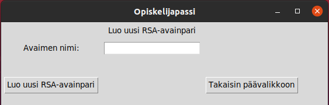
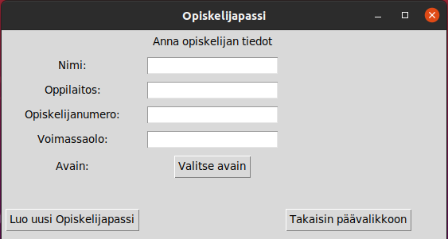
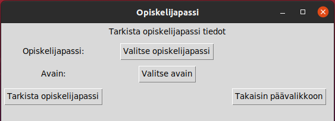
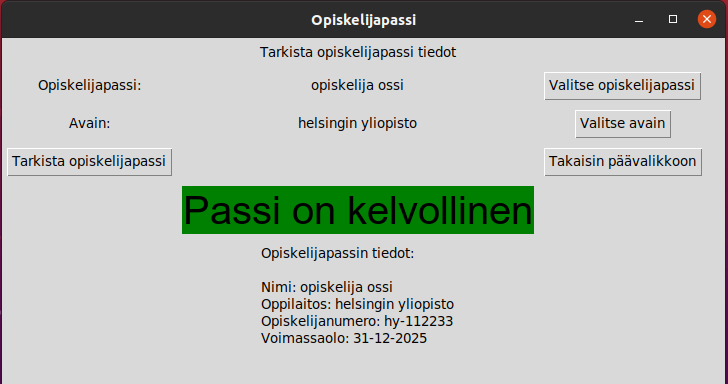

## Käyttöohje

- Ohjelma vaatii toimiakseen vähintään Python 3.8 version sekä Poetry-komentorivityökalun. Voit asentaa Poetryn osoitteesta https://python-poetry.org/ .

- Poetryn asentamisen jälkeen, kloonaa repositorio ja asenna ohjelman riippuvuudet suorittamalla kloonatun repositorion juuressa komento:

```bash
poetry install
```
- Ohjelman voi käynnistää komennolla:
```bash
poetry run invoke run
```
- Yksikkötestien suoritus tapahtuu komennolla:
```bash
poetry run invoke test
```

Ohjelman päävalikko näyttää seuraavalta:


Päävalikosta voidaan valita seuraavat toiminallisuudet:

- Luo uusi Opiskelijapassi
- Tarkista Opiskelijapassi
- Luo uusi avainpari

On suositeltavaa luoda ensin uusi avainpari, jos sellaista ei ole valmiina käytettävissä, sillä uuden opiskelijapassin luominen edellyttää olemassa olevaa avainta.


## Luo uusi avainpari

Luo uusi avainpari valitsemalla päävalikosta 'Luo uusi avainpari'. Komennosta aukeaa seuraava näkymä:



Syötä uuden avainparin nimi 'Avaimen nimi'-kenttään ja paina 'Luo uusi RSA-avainpari'. Ohjelma luo uuden avainparin repositorion juureen, kansioon nimeltä 'keys'. Kun avainpari on luotu, voidaan palata takaisin päävalikkoon ja luoda uusi opiskelijapassi.

## Luo uusi Opiskelijapassi

Luo uusi opiskelijapassi valitsemalla päävalikosta 'Luo uusi Opiskelijapassi'. Komennosta aukeaa seuraava näkymä:



Täytä kaikki näkyvissä olevat kentät ja valitse avain jolla allekirjoitus tehdään. Käytä avainpareista yksityistä avainta allekirjoituksen tekemiseen, jolloin voit jakaa julkisen avaimen ja sitä voidaan käyttää allekirjoituksen tarkistamiseen. Jos loit avainparin ohjelman avulla, löydät yksityisen avaimen kansiosta 'keys/private_key/'. 


Paina näppäintä 'Luo uusi Opiskelijapassi', jolloin ohjelma luo uuden opiskelijapassin repositorion juureen kansioon 'opiskelijapassit'. Opiskelijapassin nimi määräytyy edellä annetun 'nimi'-kentän syötteestä. 


## Tarkista Opiskelijapassi

Tarkista opiskelijapassi valitsemalla päävalikosta 'Tarkista Opiskelijapassi'. Komennosta aukeaa seuraava näkymä:



Valitse tarkistettava opiskelijapassi ja tarkistukseen käytettävä avain. Opiskelijapassin löydät repositorion juuresta kansiosta 'opiskelijapassit/'. Käytä tarkistukseen julkista avainta. Julkisen avaimen löydät repositorion juuresta kansiosta 'keys/public_key/'. Paina näppäintä 'Tarkista opiskelijapassi'.

Jos opiskelijapassi on kelvollinen, eli sen sisältö ei ole muuttunut ja allekirjoitus täsmää julkiseen avaimeen, ilmoittaa ohjelma passin olevan kelvollinen. 




Jos taas opiskelijapassin sisältö on muuttunut tai avain ei täsmää allekirjoitukseen, ilmoittaa ohjelma passin olevan virheellinen. 


## Muita huomioita

Passin tarkistuksessa tulee aina käyttää allekirjoituksessa käytetyn yksityisen avaimen vastaparia, eli julkista avainta. Jos tarkistuksessa käytetään jotain muuta avainta, eivät allekirjoitus täsmää ja ohjelma ilmoittaa virheellisestä passista. 

Jos passin sisältö muuttuu, muuttuu myös allekirjoitus. Tällöin vanha allekirjoitus ei ole enää voimassa ja ohjelma ilmoittaa virheellisestä passista. Jos passin tietoja halutaan muuttaa/päivittää, tulee siitä luoda uusi versio ja allekirjoittaa se uudestaan alkuperäisellä avaimella. 

Yksityistä avainta tulisi säilyttää huolellisesti ja luovuttaa ainoastaan luotettaville tahdoille. Yksityinen avain mahdollistaa mielivaltaisten passien luonnin, ja vahingon sattuessa tulee kyseisen avaimen käyttö lopettaa. Tällöin joudutaan luomaan uusi avainpari ja allekirjoittaa kaikki aiemmin myönnetyt passit uudestaan. 

Julkista avainta voidaan jakaa vapaasti eri osapuolille, sillä sitä käytetään ainoastaan passin tarkistukseen. 

Jos ohjelmassa halutaan käyttää ulkopuolisia avaimia, tulee ne olla seuraavassa JSON-muodossa:

Yksityinen avain:
```
{
    "key_pair": {
        "key_name": "helsingin yliopisto",
        "public_key": {
            "modulus": 944331213669267298109699547386283516120829,
            "exponent": 65537
        },
        "private_key": {
            "modulus": 944331213669267298109699547386283516120829,
            "exponent": 4904868168103797675763945953130154
        }
    }
}
```

Julkinen avain:
```
{
    "key_pair": {
        "key_name": "helsingin yliopisto",
        "public_key": {
            "modulus": 944331213669267298109699547386283516120829,
            "exponent": 65537
        }
    }
}
```

Jos ohjelmassa halutaan käyttää ulkopuolisia opiskelijapasseja, tulee ne olla seuraavassa JSON-muodossa:
```
{
    "opiskelijapassi": {
        "nimi": "opiskelija ossi",
        "oppilaitos": "helsingin yliopisto",
        "opiskelijanumero": "hy-112233",
        "voimassaolo": "31-12-2025"
    },
    "allekirjoitus": 8180982337217006341306704279042473164310372813112
}
```

