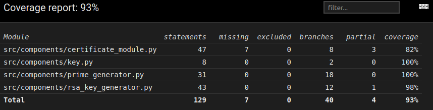

## Testausdokumentti

Ohjelmaa testataan automaattisilla yksikkötesteillä Pythonin Pytestin avulla. Testit löytyvät projektin juurihakemiston src/tests kansiosta. Yksittäisten metodien,allekirjoituksen ja alkulukujen testaamisen lisäksi, testisyötteenä on 10 000 alkulukua ja 8770 yhdistettyä lukua.

Testit voidaan suorittaa ja toistaa ajamalla komento: 

```bash 
poetry run invoke test
```

Ohjelman testikattavuusraportti saadaan suorittamalla komento:

```bash
poetry run invoke coverage
```

Tällöin projektin juurikansiosta löytyvän 'htmlcov' kansioon generoituu 'index.html' tiedosto, joka voidaan avata selaimella. Raportti kertoo testikattavuuden ja yksilöi mitä tiedostoja testattiin ja mikä yksittäisen tiedoston testikattavuus on. 

Seuraavaksi kuva kyseisestä raportista:




## Suorituskykytestaus

Ohjelman suorituskykyä testattiin luomalla erikokoisia avaimia. Ohjelman suorituskyky ja nopeus on riippuvainen avaimien pituudesta. Mitä pidempi avain on, sitä turvallisempi salaus on. Tämä ohjelma käyttää 1024-bittisiä avaimia. 

Alla keskimääräinen aika avaimen luomiseen, riippuen avaimen pituudesta:

1024-bit: 0.72 sek.

2048-bit: 5.22 sek.

4096-bit: 32.67 sek.
